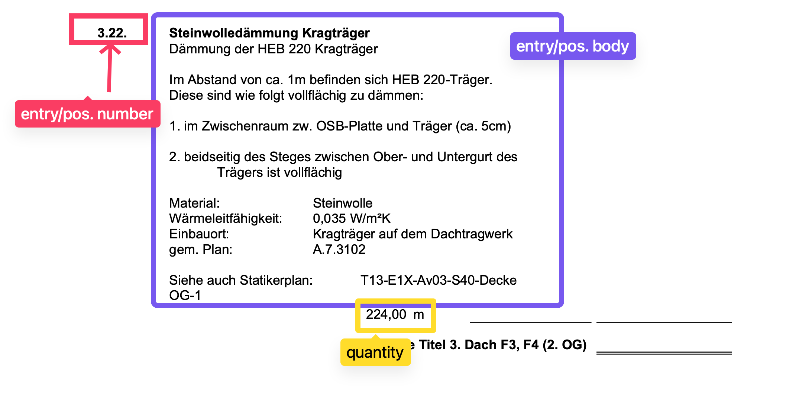

# TenderFix Document Analysis and Product Mapping

## Overview

This take-home task involves analyzing a set of PDF documents related to ABS-Lock products and extracting relevant information to create a comprehensive CSV file. The task is divided into three main parts:

1. Mapping assigned integers to document numbers (belegnummer) using the `lookup.csv` file.
2. Identifying the relevant "artikelnummer" (product numbers) for each entry in the PDF documents using the `mapToProducts.csv` file.
3. Extracting text from the PDF documents, associating entry numbers, entry bodies, and quantities to create a structured CSV file.

Finally, you will combine the results from these tasks to generate a single CSV file containing all the relevant information.

## Prerequisites

To complete this task, you will need the following:

- Docker and Docker Compose installed on your machine
- Python programming skills
- Familiarity with SQL databases (SQLite in this case)
- Knowledge of web frameworks such as FastAPI, Flask, or Django
- Understanding of PDF text extraction techniques

## Task Details

### 1. Mapping Assigned Integers to Document Numbers

- You are provided with a `lookup.csv` file that contains a mapping between assigned integers and document numbers (belegnummer).
- Create a Docker Compose file that sets up an SQLite database and a Python server.
- Write Python code to push the data from `lookup.csv` into the SQLite database.

> Optionally, you have the choice to either:
> - Create a server route within your Python application (utilizing frameworks like FastAPI, Flask, or Django) that accepts an assigned integer as input and returns the corresponding document number.
> - Directly incorporate this logic into your Python scripts, bypassing the need to establish an API route.

#### example output (these are fictional value and doesn't present the one from the file)

| assigned_integer | belegnummer |
| ---------------- | ----------- |
| 12185            | 12100010    |
| 286              | 12100024    |

### 2. Identifying Product Numbers for Entries

- The `mapToProducts.csv` file contains information about the entries in the PDF documents and their associated product numbers (artikelnummer).
- Create another route in your Python server that takes a document number as input and finds the corresponding entries in the `mapToProducts.csv` file.
- An entry consists of the following components:
  - Entry number/position number: A unique identifier for the entry, such as "1.01" or "2.0.55.1".
  - Entry body: The text describing the requested items or requirements, usually located on the right or bottom of the entry number.
  - Quantity: The quantity associated with the entry.
- Use the columns in the `mapToProducts.csv` file to identify the entry numbers and their associated product numbers.
- The output of this task should be a CSV file with the following columns: assigned_integer, belegnummer (document number), entry number, and a list of identified product numbers for each entry.

#### example output (these are fictional value and doesn't present the one from the file)

| assigned_integer | belegnummer | entry_number | product_numbers             |
| ---------------- | ----------- | ------------ | --------------------------- |
| 12185            | 12100010    | 1.0.1        | LX-H-400-16-SR, LX-H-400-16 |
| 12185            | 12100010    | 2.13         | ZU-1009A-F, ZU-1009-F       |
| 286              | 12100024    | 9.23         | LX-SR-B-500, L3-BE-500      |
| 286              | 12100024    | 2.00.1       | LX-H-500-16-SR, LX-H-500-16 |

### 3. Extracting Text and Associating Entry Information

- This task involves two sub-tasks:
  1. Extracting text from the PDF documents:
     - Use various techniques (your choice) to extract the text from each PDF document in the `pdfs` directory.
  2. Associating entry numbers, entry bodies, and quantities:
     - Analyze the extracted text to identify entry numbers, entry bodies, and quantities.
     - Consider how the text flows across pages and handle cases where entries are split across multiple pages.
     - Properly associate the entry bodies and quantities with their respective entry numbers.
- The output of this task should be a CSV file with the following columns: assigned_integer, belegnummer (document number), entry number, entry body, and quantity.
  

> For any additional clarity or help, feel free to reach out to [kush@tenderfix.ai](mailto:kush@tenderfix.ai).
#### example output (these are fictional value and doesn't present the one from the file)

| assigned_integer | belegnummer | entry_number | entry_body                                                                                                                                                                                                                                                                                                                                                                                                                                                                       | quantity |
| ---------------- | ----------- | ------------ | -------------------------------------------------------------------------------------------------------------------------------------------------------------------------------------------------------------------------------------------------------------------------------------------------------------------------------------------------------------------------------------------------------------------------------------------------------------------------------- | -------- |
| 12185            | 12100010    | 1.0.1        | Lieferung und Einbau von Leitprodukt: ZU-1009A-F / ABS Therm mit flachem Deckel, Thermoschutzhaube (330 mm) aus Kunststoff für Systeme mit Stützrohr. Montage oberhalb der Dachmembran. UV- und witterungsbeständig. Individuell einkürzbar. Hersteller: ABS Safety GmbH Angebotenes Fabrikat und Type:                                                                                                                                                                          | 1,000 St |
| 12185            | 12100010    | 2.13         | Endmontage der Seile und Zertifizierung sowie Einweisung in die Systeme. Voraussetzung: freier und gesicherter Zugang zu allen Bauteilen. Stützen bauseits gesetzt und eigedichtet! Bitte geben Sie uns vor Montage die genauen Seillängen bekannt! Dieses Angebot beinhaltet eine An- und Abfahrt. Die Abnahme und Einweisung erfolgt zusammenhängend.                                                                                                                          | 4,000 St |
| 286              | 12100024    | 9.23         | gebogene Ausführung Wie Vorposition, jedoch gebogene Ausführung gem. Plan. A.7.2044 Rundung Nr. 11, 12                                                                                                                                                                                                                                                                                                                                                                           | 2,000 St |
| 286              | 12100024    | 2.00.1       | Seilsicherungssystem-Wartung wie Pos. 22.1. jedoch für: gesamtes Seilsicherungssystem des Daches Hierfür ist eine Zertifizierung nach EU-Richtlinien erforderlich.RWA-Wartung nach der Gewährleistung wie Pos. 22.1. jedoch: für Zeit nach der Gewährleistung. Hierfür ist ein separates Angebot dem LV beizulegen. Seilsicherung -Wartung nach der Gewährleistung wie Pos. 22.2. jedoch: für Zeit nach der Gewährleistung. Hierfür ist ein separates Angebot dem LV beizulegen. | 6,000 St |

### Final Output

- Combine the CSV files from tasks 2 and 3 to create a final CSV file with the following columns:
  - assigned_integer
  - belegnummer (document number)
  - entry number
  - entry body
  - quantity
  - list of products for that entry

#### example output (these are fictional value and doesn't present the one from the file)

| assigned_integer | belegnummer | entry_number | entry_body                                                                                                                                                                                                                                                                                                                                                                                                                                                                       | quantity | product_numbers             |
| ---------------- | ----------- | ------------ | -------------------------------------------------------------------------------------------------------------------------------------------------------------------------------------------------------------------------------------------------------------------------------------------------------------------------------------------------------------------------------------------------------------------------------------------------------------------------------- | -------- | --------------------------- |
| 12185            | 12100010    | 1.0.1        | Lieferung und Einbau von Leitprodukt: ZU-1009A-F / ABS Therm mit flachem Deckel, Thermoschutzhaube (330 mm) aus Kunststoff für Systeme mit Stützrohr. Montage oberhalb der Dachmembran. UV- und witterungsbeständig. Individuell einkürzbar. Hersteller: ABS Safety GmbH Angebotenes Fabrikat und Type:                                                                                                                                                                          | 1,000 St | LX-H-400-16-SR, LX-H-400-16 |
| 12185            | 12100010    | 2.13         | Endmontage der Seile und Zertifizierung sowie Einweisung in die Systeme. Voraussetzung: freier und gesicherter Zugang zu allen Bauteilen. Stützen bauseits gesetzt und eigedichtet! Bitte geben Sie uns vor Montage die genauen Seillängen bekannt! Dieses Angebot beinhaltet eine An- und Abfahrt. Die Abnahme und Einweisung erfolgt zusammenhängend.                                                                                                                          | 4,000 St | ZU-1009A-F, ZU-1009-F       |
| 286              | 12100024    | 9.23         | gebogene Ausführung Wie Vorposition, jedoch gebogene Ausführung gem. Plan. A.7.2044 Rundung Nr. 11, 12                                                                                                                                                                                                                                                                                                                                                                           | 2,000 St | LX-SR-B-500, L3-BE-500      |
| 286              | 12100024    | 2.00.1       | Seilsicherungssystem-Wartung wie Pos. 22.1. jedoch für: gesamtes Seilsicherungssystem des Daches Hierfür ist eine Zertifizierung nach EU-Richtlinien erforderlich.RWA-Wartung nach der Gewährleistung wie Pos. 22.1. jedoch: für Zeit nach der Gewährleistung. Hierfür ist ein separates Angebot dem LV beizulegen. Seilsicherung -Wartung nach der Gewährleistung wie Pos. 22.2. jedoch: für Zeit nach der Gewährleistung. Hierfür ist ein separates Angebot dem LV beizulegen. | 6,000 St | LX-H-500-16-SR, LX-H-500-16 |

## Additional Considerations

- You can use multithreading, batch processing, or spin up multiple machines to parallelize the processing of PDF documents and improve performance.
- Ensure that your solution is fully containerized using Docker and Docker Compose.
- Create a detailed documentation explaining your approach, the process to set up and run your solution, and any assumptions or decisions made during the implementation.

## Submission

- Provide a GitHub repository containing your code, Docker files, and documentation.
- Include a README file with clear instructions on how to set up and run your solution.
- Ensure that your code is well-structured, readable, and properly commented.
- If you have any questions or need further clarification, please don't hesitate to reach out via email: [kush@tenderfix.ai](mailto:kush@tenderfix.ai) or [mohit@tenderfix.ai](mailto:mohit@tenderfix.ai) 

Good luck with the task! We look forward to reviewing your solution.
